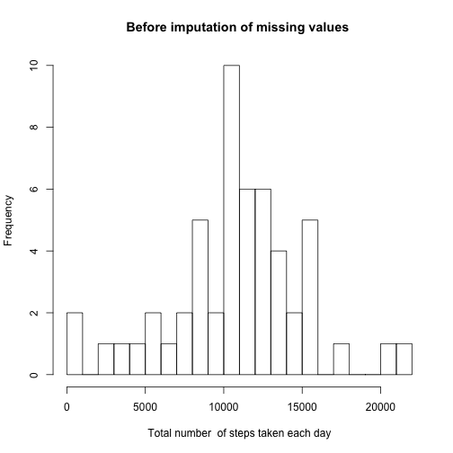
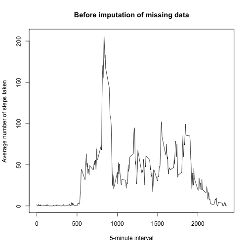
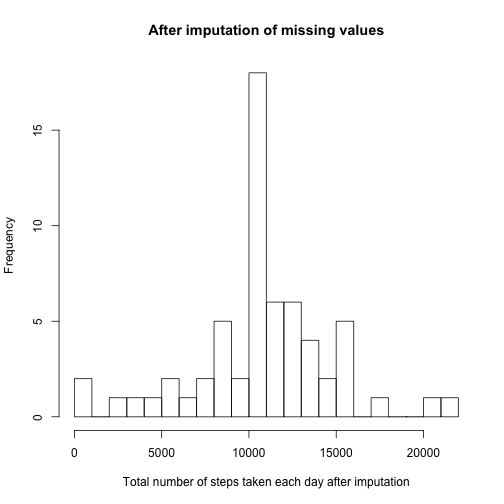
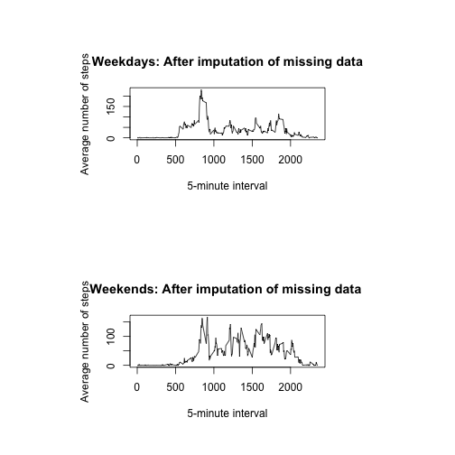

Project Assignment 1
==============================

1. Show any code that is needed to

- Load the data (i.e. read.csv())

- Process/transform the data (if necessary) into a format suitable for your analysis

```r
# Create working directory
if(!file.exists("/Users/seanwenweixiong/Documents/Coursera/Data_Science/5_Reproducible_Research/Week_2")) {
dir.create("/Users/seanwenweixiong/Documents/Coursera/Data_Science/5_Reproducible_Research/Week_2")
}

# Link to file
url <- "https://d396qusza40orc.cloudfront.net/repdata%2Fdata%2Factivity.zip"

# Download file
download.file(url, destfile="/Users/seanwenweixiong/Documents/Coursera/Data_Science/5_Reproducible_Research/Week_2/activity.zip", method="curl")

# Unzip file
unzip("/Users/seanwenweixiong/Documents/Coursera/Data_Science/5_Reproducible_Research/Week_2/activity.zip", exdir="./Documents/Coursera/Data_Science/5_Reproducible_Research/Week_2/")

# Read file
activity <- read.csv("/Users/seanwenweixiong/Documents/Coursera/Data_Science/5_Reproducible_Research/Week_2/activity.csv")
```
2. What is mean total number of steps taken per day? 

- For this part of the assignment, you can ignore the missing values in the dataset.

- Calculate the total number of steps taken per day

- If you do not understand the difference between a histogram and a barplot, research the difference between them. Make a histogram of the total number of steps taken each day

- Calculate and report the mean and median of the total number of steps taken per day

```r
# Tabulate the total number of steps taken per day
s <- aggregate(steps ~ date, data=activity, sum)
head(s)
```

```
##         date steps
## 1 2012-10-02   126
## 2 2012-10-03 11352
## 3 2012-10-04 12116
## 4 2012-10-05 13294
## 5 2012-10-06 15420
## 6 2012-10-07 11015
```

```r
# Plot histogram of the total number of steps taken each dat
hist(s$steps, breaks=30, main="Before imputation of missing values ", xlab="Total number  of steps taken each day")
```



```r
# mean of the total number of steps taken each day
mean(s$steps)
```

```
## [1] 10766.19
```

```r
# median of the total number of steps taken each day
median(s$steps)
```

```
## [1] 10765
```
3. What is the average daily activity pattern?

- Make a time series plot (i.e. type = "l") of the 5-minute interval (x-axis) and the average number of steps taken, averaged across all days (y-axis)

- Which 5-minute interval, on average across all the days in the dataset, contains the maximum number of steps?

```r
# Tabulate the average number of steps taken for each 5-minute time interval
m <- aggregate(steps ~ interval, data=activity, mean, na.rm=TRUE)
head(m)
```

```
##   interval     steps
## 1        0 1.7169811
## 2        5 0.3396226
## 3       10 0.1320755
## 4       15 0.1509434
## 5       20 0.0754717
## 6       25 2.0943396
```

```r
# Plot the time series plot of the 5-minute interval and the average number of steps taken
plot(m$interval, m$steps, type="l", col="black", main="Before imputation of missing data", xlab="5-minute interval", ylab="Average number of steps taken")
```



```r
# Find the 5-minute interval with the maximum number of steps
m[which.max(m$steps), "interval"]
```

```
## [1] 835
```
4. Imputing missing values

- Note that there are a number of days/intervals where there are missing values (coded as NA). The presence of missing days may introduce bias into some calculations or summaries of the data.

- Calculate and report the total number of missing values in the dataset (i.e. the total number of rows with NAs)

- Devise a strategy for filling in all of the missing values in the dataset. The strategy does not need to be sophisticated. For example, you could use the mean/median for that day, or the mean for that 5-minute interval, etc.

- Create a new dataset that is equal to the original dataset but with the missing data filled in.

- Make a histogram of the total number of steps taken each day and calculate and report the mean and median total number of steps taken per day. Do these values differ from the estimates from the first part of the assignment? What is the impact of imputing missing data on the estimates of the total daily number of steps?

```r
# Tabulate the total number of missing values in the dataset
sum(is.na(activity$steps))
```

```
## [1] 2304
```

```r
sum(is.na(activity$date))
```

```
## [1] 0
```

```r
sum(is.na(activity$interval))
```

```
## [1] 0
```

```r
# Replace missing value with the mean of the 5-minute interval
fillNA <- numeric()
for (i in 1:nrow(activity)) {
    obs <- activity[i, ]
    if (is.na(obs$steps)) {
        steps <- subset(m, interval == obs$interval)$steps
    } else {
        steps <- obs$steps
    }
    fillNA <- c(fillNA, steps)
}

# Create separate data frame
activity2 <- activity

# Fill in missing values
activity2$steps <- fillNA
head(activity2)
```

```
##       steps       date interval
## 1 1.7169811 2012-10-01        0
## 2 0.3396226 2012-10-01        5
## 3 0.1320755 2012-10-01       10
## 4 0.1509434 2012-10-01       15
## 5 0.0754717 2012-10-01       20
## 6 2.0943396 2012-10-01       25
```

```r
# Calculate the total number of steps taken each day after imputating missing values
s2 <- aggregate(steps ~ date, data=activity2, sum)

# Plot the total number of steps for each day after imputing missing values
hist(s2$steps, breaks=30, main="After imputation of missing values", xlab="Total number of steps taken each day after imputation")
```



```r
# Mean sum of steps each day after imputing missing values
mean(s2$steps)
```

```
## [1] 10766.19
```

```r
# Median sum of steps each day after imputing missing values
median(s2$steps)
```

```
## [1] 10766.19
```
The impact of imputing missing data on the estimates of the total daily number of steps is negligible

5. Are there differences in activity patterns between weekdays and weekends?

- For this part the weekdays() function may be of some help here. Use the dataset with the filled-in missing values for this part.

- Create a new factor variable in the dataset with two levels – “weekday” and “weekend” indicating whether a given date is a weekday or weekend day.

- Make a panel plot containing a time series plot (i.e. type = "l") of the 5-minute interval (x-axis) and the average number of steps taken, averaged across all weekday days or weekend days (y-axis). See the README file in the GitHub repository to see an example of what this plot should look like using simulated data.

```r
# Create day type column
activity2$daytype <- factor(weekdays(as.Date(activity2$date)))

# Categorize days into weekdays and weekends
levels(activity2$daytype) <- list(weekday=c("Monday", "Tuesday", "Wednesday", "Thursday", "Friday"), weekend = c("Saturday", "Sunday"))

# Tabulate the average number of steps taken for each 5-minute time interval on weekdays
m_weekdays <- aggregate(steps ~ interval, data=activity2[activity2$daytype == "weekday",], mean, na.rm=TRUE)

# Tabulate the average number of steps taken for each 5-minute time interval on weekends
m_weekends <- aggregate(steps ~ interval, data=activity2[activity2$daytype == "weekend",], mean, na.rm=TRUE)

# Plot the time series plot of the 5-minute interval and the average number of steps taken on weekdays and weekends
par(mfrow=c(2,1), pin=c(3,0.8))
plot(m_weekdays$interval, m_weekdays$steps, type="l", col="black", main="Weekdays: After imputation of missing data", xlab="5-minute interval", ylab="Average number of steps")
plot(m_weekends$interval, m_weekends$steps, type="l", col="black", main="Weekends: After imputation of missing data ", xlab="5-minute interval", ylab="Average number of steps")
```




